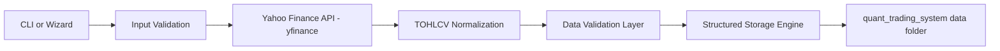
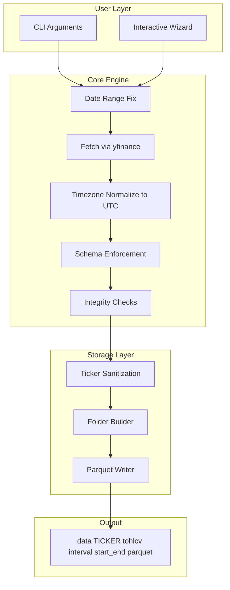

# 📊 FOHLCV

### Institutional TOHLCV Downloader — Yahoo Finance


Minimal, deterministic and structured downloader for
**Time, Open, High, Low, Close, Volume (TOHLCV)**
from **Yahoo Finance**, ready to integrate into quantitative systems.

Designed to plug directly into:

```
quant_trading_system/data
```

---

# 🧠 Philosophy

FOHLCV is intentionally:

* Deterministic
* Clean
* Reproducible
* Structurally organized
* Integration-ready

It does **one thing only** — download clean TOHLCV data correctly.

No features.
No targets.
No alpha.
Just high-quality raw market data.

---

# 🏗 Architecture

## High-Level Flow



---

## Detailed Architecture



---

# 📂 Data Structure

All data is stored in a deterministic institutional layout:

```
C:\Users\axier\Desktop\CARPETA PROGRAMACION\quant_trading_system\data

data/
  <TICKER_SANITIZED>/
    tohlcv/
      <INTERVAL>/
        <START>_<END>.parquet
```

---

## Example

```
data/
  BTC_USD/
    tohlcv/
      1h/
        2025_01_01_2026_01_01.parquet
```

---

# 📦 Output Schema

| Column | Type           |
| ------ | -------------- |
| time   | datetime (UTC) |
| open   | float          |
| high   | float          |
| low    | float          |
| close  | float          |
| volume | float          |

Sorted ascending by time.
No duplicates.
UTC normalized.

---

# 🚀 Usage

## Wizard Mode (Recommended)

```bash
python -m src.fohlcv.cli
```

Interactive selection:

* Asset type
* Ticker
* Interval
* Start date
* End date
* Output format

---

## Direct Mode

```bash
python -m src.fohlcv.cli --ticker BTC-USD --interval 1h --start 2025-01-01 --end 2026-01-01
```

Using period:

```bash
python -m src.fohlcv.cli --ticker ^GSPC --interval 1d --period 1y
```

---

# 🌍 Supported Markets

### 🇺🇸 USA

* `^GSPC` — S&P 500
* `^IXIC` — Nasdaq
* `^DJI` — Dow Jones
* `^RUT` — Russell 2000
* `^VIX` — Volatility Index

### 🇪🇺 Europe

* `^STOXX50E` — Euro Stoxx 50
* `^GDAXI` — DAX
* `^FCHI` — CAC 40
* `^FTSE` — FTSE 100
* `^IBEX` — IBEX 35

### 🇨🇳 China

* `000001.SS` — Shanghai Composite
* `000300.SS` — CSI 300
* `^HSI` — Hang Seng

### Crypto

* `BTC-USD`
* `ETH-USD`
* `SOL-USD`

### FX

* `EURUSD=X`
* `GBPUSD=X`
* `USDJPY=X`

### Commodities

* `GC=F` — Gold
* `CL=F` — Crude Oil
* `SI=F` — Silver

---

# ⚠ Important Notes

## 1️⃣ Yahoo treats `end` as exclusive

If:

```
start = 2025-01-01
end   = 2025-01-01
```

The system automatically converts:

```
end = 2025-01-02
```

To ensure data is returned.

---

## 2️⃣ Intraday Limitations

Yahoo may limit:

* Long historical intraday ranges
* Certain futures intraday data
* Some index tickers

If download fails:

* Try `interval=1d`
* Or use `--period 30d`
* Or reduce date range

---

# 🧩 Integration Ready

FOHLCV is built to feed:

* Feature engineering pipelines
* Forward return engines
* Regime models
* Backtesting systems
* Execution simulators
* Liquidity models

It is the **data foundation layer**.

---

# 🔮 Future Extensions

* Manifest JSON per dataset
* Dataset hashing
* Incremental updates
* Multi-asset batch mode
* Binance / CCXT integration
* Market calendar alignment
* Corporate actions merge
* Funding rate layer

---

# 🏛 Design Principle

> Raw data first.
> Deterministic structure.
> Zero ambiguity.
> Production-grade organization.

---

# 📜 License

Research & quantitative development purposes.
Yahoo Finance availability subject to change.
